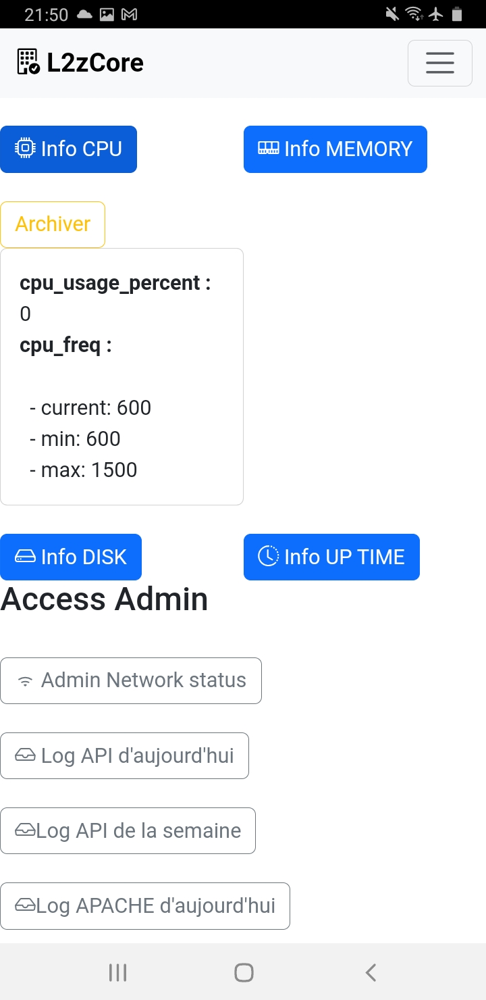
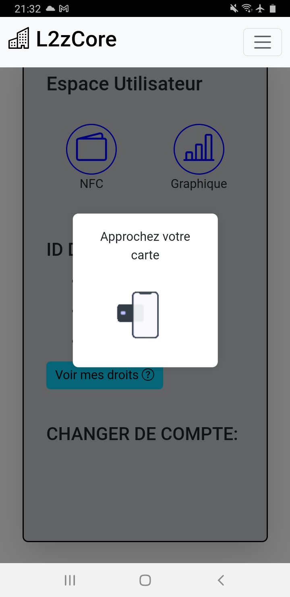

# README : Application mobile de Supervision de Serveurs ( Saé Développer des applications communicantes )

## Auteur

- **Nom** : Lambert
- **Prénom** : Lenny

---
## Version

- **Version** : 1.0
- **Date** : Date de sortie: 23/01/2025
- **Instalation** : 
    - ``` git clone https://github.com/lenzzair/www.git
          npm install
          npm run build
          npm start
     ```
## Sommaire

1. [Contexte et Objectif](#contexte-et-objectif)
2. [Cahier des Charges](#cahier-des-charges)
3. [Technologies et Méthodes](#technologies-et-méthodes)
4. [Principe de Fonctionnement](#principe-de-fonctionnement)
5. [Langages Utilisés](#langages-utilisés)
6. [Défis et Résolutions](#défis-et-résolutions)
7. [Bilan et Perspectives d'Amélioration](#bilan-et-perspectives-damélioration)
8. [Annexes](#annexes)

---

## Contexte et Objectif

### Contexte

Les administrateurs réseau des petites entreprises doivent gérer une charge de travail croissante. Ce projet vise à développer une **application mobile** centralisant les informations critiques des serveurs pour une supervision efficace.
Par exemple, un administrateur peut surveiller à distance les performances des serveurs pendant ses déplacements, éviter une surcharge CPU, ou détecter rapidement une tentative de connexion suspecte.

L'application permet de :

- Surveiller les métriques systèmes (CPU, mémoire, espace disque).
- Accéder à des données réseau (connexion, sockets).
- Visualiser les journaux d'activité (logs API et Apache).

### Objectif

Offrir une solution simple et accessible permettant aux administrateurs réseau de surveiller en temps réel l’état de leurs serveurs, même en déplacement sur leurs appareils mobile.

L'application inclut :

- Une API pour structurer les informations provenant des serveurs.
- Une interface utilisateur intuitive pour analyser les données en temps réel.
- Une sécurisation des données sensibles via des jetons JWT.
- Faciliter l'échange d'informations serveur entre collaborateurs via email.
- Gestion des contacts via le plugin Cordova.
- Lecture et gestion des cartes NFC pour l'authentification et la gestion des droits.
- Visualisation des données sous forme de graphiques interactifs avec Chart.js.

---

## Cahier des Charges

- **Framework** : Cordova.
- **Fonctionnalités libres** mais doivent inclure au moins un plugin asynchrone.
- **Librairies graphiques** :
  - Bootstrap.
  - Chart.js.
- **Persistance des données**.
- Utilisation de **librairies externes**.

---

## Technologies et Méthodes

### Technologies Utilisées

- **Cordova** : Pour développer une application mobile multi-plateforme.
- **Visual Studio Code** avec Git pour le versionnement.
- **Librairies graphiques** :
  - **Bootstrap** pour créer des interfaces réactives.
  - **Chart.js** pour des graphiques interactifs.
- **Plugins** :
  - **cordova-plugin-email-composer** : Envoi d'emails.
  - **cordova-plugin-contacts-x** : Gestion des contacts.
  - **cordova-plugin-network-information** : Fournit des informations sur la connexion cellulaire et Wi-Fi.
  - **cordova-plugin-dialogs** : Affichage de dialogues natifs.
  - **cordova-plugin-nfc** : Gestion des interactions NFC.
  - **cordova-plugin-splashscreen** : Gestion du logo lors du chargement de l'application

- **API** :
  - **L2zCore API** : API personnelle hébèreger sur le serveur même et qui récupère plusieurs données lier aux serveur

  ## Endpoints de l'API

| Méthode | Endpoint                        | Description                                                                                         | Authentification | Paramètres                |
|---------|----------------------------------|-----------------------------------------------------------------------------------------------------|------------------|---------------------------|
| POST    | `/token`                         | Crée un token d'authentification en envoyant un `username` et un `password`.                         | Oui              | `username`, `password`    |
| GET     | `/system/cpu`                    | Récupère les informations CPU du serveur.                                                          | Non              | Aucun                     |
| GET     | `/system/memory`                 | Récupère les informations de mémoire du serveur.                                                   | Non              | Aucun                     |
| GET     | `/system/disk`                   | Récupère les informations d'espace disque du serveur.                                              | Non              | Aucun                     |
| GET     | `/system/uptime`                 | Récupère les informations du nombre de temps que le serveur est allumé                             | Non              | Aucun                     |
| GET     | `/network/connections`           | Récupère les informations sur les connexions réseau du serveur (sockets, ports, etc.).             | Oui              | Aucun                     |
| GET     | `/log/api/today_ip`              | Récupère les adresses IP des requêtes API du jour.                                                  | Oui              | Aucun                     |
| GET     | `/log/apache/connexion_web/today`| Récupère les logs Apache des connexions du jour.                                                   | Oui              | Aucun                     |
| POST    | `/nfc/verify`                    | Vérifie une carte NFC scannée en envoyant son `id` et récupère les informations associées.          | Oui              | `nfc_id`                  |
| POST    | `/nfc/account`                   | Crée un compte associé à une nouvelle carte NFC.                                                   | Oui              | `nfc_id`, `user_info`     |


---

## Principe de Fonctionnement

### Intégration des Plugins

- Le plugin **cordova-plugin-email-composer** permet a un administrateur d'envoyer un rapport détaillé à un collegue avec les métrique de la journé où celle qui ont été archiver
- Le plugin **cordova-plugin-contacts-x** facilite l'accès aux contacts pour les communications, permet de récupèré l'adresse mail et le numéro a l'aide du nom d'un collègue.
- Le plugin **cordova-plugin-nfc** permet la lecture des cartes NFC pour l'authentification et la gestion des droits.
- Le plugin **cordova-plugin-network-information** fournit des informations sur l'état de la connexion réseau, si le téléphone est bien connecter a internet.
- Le plugin **cordova-plugin-dialogs** permet d'afficher des alertes et des dialogues natifs.

### Communication avec l’API

L'API L2zCore structure et renvoie les informations du serveur Apache, intégrant:

- Les métriques systèmes.
- Les journaux d'activité.
- Les données réseau.
- La base de donnée liées aux cartes NFC

### Visualisation des Données

- **Chart.js** : Pour des graphiques clairs et interactifs (courbes, barres).

---

## Langages Utilisés

- **HTML et CSS** : Structure et style de l'application.
- **JavaScript** : Fonctionnalités dynamiques.
- **Python** : Intégration et gestion de l’API.

---

## Fonctionnement des parties principales

## Utilisation de l'API

#### Commentaire: 

Cette fonction va faire un appelle a la fonction get() en lui envoyant comme paramètre:
- **param** : param va noous permettre a la suite de savoir qu'elle endpoint a été appeler et donc comment traiter la réponse
- **token** : ici il n'y a pas token car les donnée cpu ne sont pas classé senssible mais sinon token va récupéré dans les cookie le token valide
```javascript
function get_cpu() {
    // ++++++++++++++++++++++++++++++++++++++++++++++++++++++++++++
    // Appelle API qui récupère le CPU en temps réel du serveur
    // ++++++++++++++++++++++++++++++++++++++++++++++++++++++++++++

    console.log("CPU Appelle");
    param = "CPU"
    get("https://cheveux-bleus.fr:16800/system/cpu", param);
}
```

 Cette fonction va crée une nouvelle instance XMLHttpRequest et va envoyer une requête GET sur L2zCore API en fonction de l'url qui a été appellé. Et va appeler statechange qui va traiter la réponse du serveur.
```javascript

function get(url, param, token)
// +++++++++++++++++++++++++++++++++++++++++++++++++++++++++++
// Fonction pour effectuer une requête HTTP GET vers une URL donnée.
// Paramètres d'entrée :
// - url (string) : L'URL de la ressource à laquelle effectuer la requête.
// La fonction utilise un objet XMLHttpRequest pour envoyer la requête.
// - param (object) : Paramètres supplémentaires (actuellement inutilisés ici).
// - token (string) : Jeton d'authentification pour l'en-tête Authorization.
// +++++++++++++++++++++++++++++++++++++++++++++++++++++++++++
{
    console.log("URL appelle");
    const XHR = new XMLHttpRequest();
    XHR.param = param;
    XHR.onreadystatechange = statechange;
    XHR.open("GET", url);
    XHR.setRequestHeader("Accept", "application/json");
    XHR.setRequestHeader("Authorization", `Bearer ${token}`);
    XHR.send();
}
```

Cette fonction montre un exemple du traitement d'une des réponse possible de l'api
XHR.param est la pour pouvoir déterminer quelle endpoint a été appeler et donc comment la traiter

```javascript
function statechange(event) {
    console.log("StateChange appelle");
    const XHR = event.target;


    switch (XHR.readyState) {
        case 0: console.log("Requête non initialisée"); break
        case 1: console.log("Connexion établie avec le serveur"); break;
        case 2: console.log("Requête reçue"); break;
        case 3: console.log("Requête en cours de traitement"); break;
        case 4:
            console.log("Requête terminée et réponse prête");

            if (XHR.status == 200) {
                console.log("Traitement local de la réponse");

                let reponse_brut = XHR.responseText;
                let reponse_objet = JSON.parse(reponse_brut);

  
                switch (XHR.param) {

                    case "CPU":
                        console.log("Reponse CPU : " + XHR.param);
                        TO_UPDATE_CPU.innerHTML = "";
                        // Mise à jour du contenu HTML
                        // Parcoure dictionnaire
                        for (let [index, nom] of Object.entries(reponse_objet)) {
                            if (typeof nom === "object" && !Array.isArray(nom)) {
                                // Si la valeur est un objet, on parcourt ses propriétés
                                TO_UPDATE_CPU.innerHTML += `<strong>${index} :</strong><br>`;
                                for (let [subIndex, subNom] of Object.entries(nom)) {
                                    TO_UPDATE_CPU.innerHTML += `&nbsp;&nbsp;- ${subIndex}: ${subNom}<br>`;
                                }
                            } else {
                                // Affichage direct pour les valeurs primitives
                                TO_UPDATE_CPU.innerHTML += `<strong>${index} :</strong> ${nom}<br>`;
                            }
                        }
                        ARCHIVE_CPU.style.display = "block";
                        temp_cpu = reponse_brut;

                        break;

```

Le bouton "Archiver" va permettre d'archiver les données afficher par la réponse en passant par le local storage


## Fonctionnement des plugins principaux:
 ---
### NFC

Le but du plugin NFC est de pouvoir se connecter a son compte qui est lié avec sa carte de travaille est qui permet d'acceder a certaine fonctionnalité.


```javascript
function get_nfc() {
    // ============================================================
    // Fonction qui permet de lire une puce NFC
    // Utilise le plugin cordova-plugin-nfc
    // ============================================================

    console.log("=========get_nfc=========");
    // ceci affiche une boite de dialog qui s'affiche lorsque l'on appuie sur le bouton de connexion a nfc et 
    // active l'ecoute nfc sur le téléphone
    DIALOG_NFC.innerHTML = 'Approchez votre carte';
    GIF_DIALOG_NFC.src = './img/nfc_anime2.gif';
    CLOSE_BTN_DIALOG_NFC.style.display = "none";
    CREATE_ACCOUNT_DIALOG.style.display = "none";


    nfc.addTagDiscoveredListener(callback_nfc, onSuccess_nfc, onFailure_nfc);  // si une entré nfc est lu elle lancera callback_nfc
}
```
### Capture d'ecran lorsque l'utilisateur lance la capture nfc


lorsqu'un puce nfc est lu cela appelle callback_nfc qui lance verife() qui permet de voir si la carte scannée n'est pas deja presente dans le session storage si non, elle envoie en POST l'id de la puce nfc au serveur lui demandant si un compte est associer a l'id de la carte
 
```javascript
function callback_nfc(nfcEvent) {
    // ------------------------------------------------------------
    // Fonction qui permet de lire une puce NFC
    // Se déclenche lorsqu'une puce NFC est détectée
    // ------------------------------------------------------------

    console.log("=======callback_nfc=======");

    let tag_nfc = nfcEvent.tag;
    let ndefId = nfc.bytesToHexString(tag_nfc.id);

    tag_nfc_scanner = ndefId;
    build_account();
    verif_sessionStorage(tag_nfc_scanner);

    UPDATE_TB_NFC.style.color = "green";
    UPDATE_TB_NFC.style.border = "2px solid green";
}
```
Lorsque le serveur a verifier que l'id de la carte nfc correspond a une ligne de sa base de donnée alors il renvoie les info les a la carte et l'application les traite et build le compte dans le session storage
## Défis et Résolutions

### Défis

- **Sécurisation** des données sensibles via JWT.
- **Intégration** fluide des plugins et librairies.
- **Visualisation** efficace des données en temps réel.

### Résolutions

- Mise en place d’un système d’authentification robuste.
- Documentation précise des plugins utilisés.
- Tests continus pour optimiser la performance.
- Nouvelle fonctionnalité.
- Permettre l'integration de l'API sur un nouveau serveur

---

## Bilan et Perspectives d'Amélioration

### Projet en cours de développement 

---

## Annexes

### Liens Utiles

- Bootstrap:  [https://getbootstrap.com/](https://getbootstrap.com/)
- Chart.js : [https://www.chartjs.org/](https://www.chartjs.org/)
- **cordova-plugin-email-composer** : [https://www.npmjs.com/package/cordova-plugin-email-composer](https://www.npmjs.com/package/cordova-plugin-email-composer)
- **cordova-plugin-contacts-x** : [https://www.npmjs.com/package/cordova-plugin-contacts-x](https://www.npmjs.com/package/cordova-plugin-contacts-x)
- **cordova-plugin-dialogs** : [https://www.npmjs.com/package/cordova-plugin-dialogs](https://www.npmjs.com/package/cordova-plugin-dialogs)
- **cordova-plugin-network-information** : [https://www.npmjs.com/package/cordova-plugin-network-information](https://www.npmjs.com/package/cordova-plugin-network-information)
- **cordova-plugin-nfc** : [https://www.npmjs.com/package/cordova-plugin-nfc](https://www.npmjs.com/package/cordova-plugin-nfc)
- **L2zCore API** : (_nom de domaine provisoire_) [https://cheveux-bleus.fr:16800/docs](https://cheveux-bleus.fr:16800/docs)

---

Merci d'avoir consulté cette documentation. N'hésitez pas à contribuer ou poser des questions via [mon GitHub](https://github.com/lenzzair) ou mon [mail](mailto:lenny@l-lambert.fr).